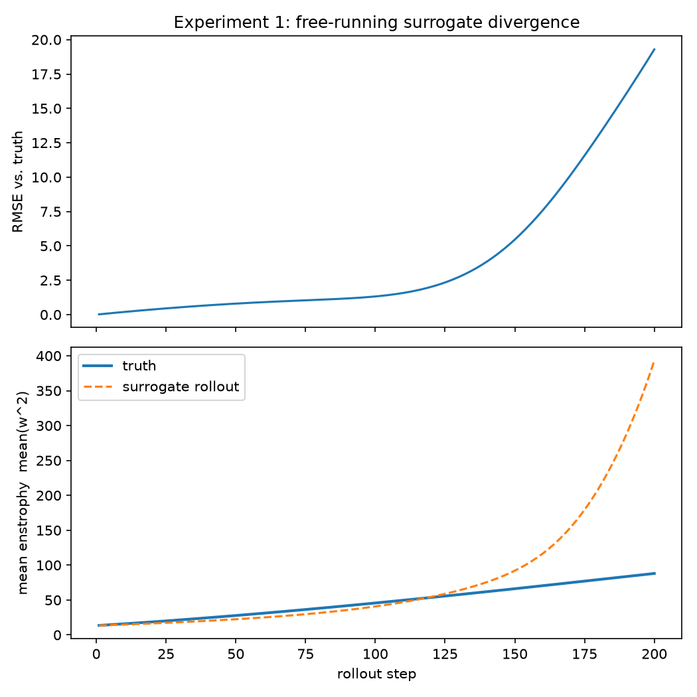
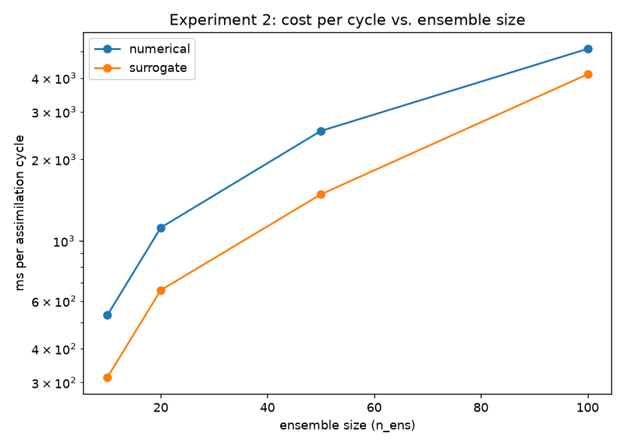
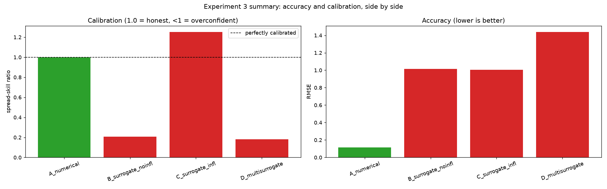
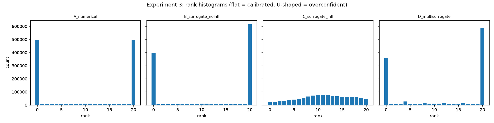
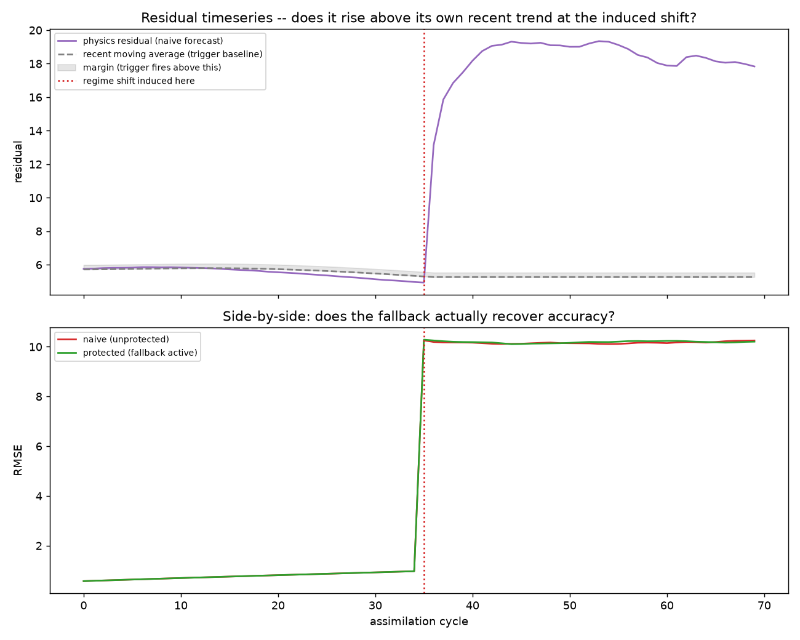
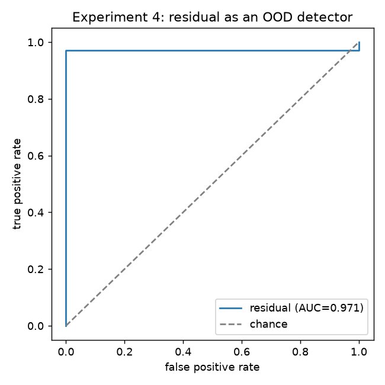

# NODA

A real-time state-estimation service that estimates a 2D turbulent vorticity field
from sparse (~1.2% coverage) noisy sensors using an ensemble Kalman filter (EnKF)
whose forecast model is a neural surrogate (Fourier Neural Operator) instead of a
numerical PDE solver.

The project's actual subject: when every ensemble member is pushed through the same
network with the same weights, the filter's only uncertainty instrument -- how much
members disagree with each other -- is structurally blind to any error the *shared
network* makes, no matter how badly wrong it is. State error still shows up as
spread and gets measured correctly; model error doesn't, and the filter reports
itself as far more trustworthy than it actually is. This repo measures that effect
with real numbers, tests whether the obvious fixes actually cure it, and builds an
independent, physics-based check that catches it in deployment.

See [CLAUDE.md](CLAUDE.md) for the full architecture, conventions, and build plan,
and [PROBLEM.md](PROBLEM.md) for the motivating write-up of *why* this matters.

## Quickstart

```bash
py -3.11 -m venv .venv
.venv\Scripts\activate
pip install -e ".[dev]"

make data   # generate train/val/test/OOD trajectories + sensor mask
make test   # run the test suite
```

Training a surrogate and running the full experiment sweep need a trained
checkpoint (`checkpoints/fno_seed0_best.eqx` at minimum -- see
[infra/aws/README.md](infra/aws/README.md) for the AWS training workflow used
throughout this project):

```bash
PYTHONPATH=src python -m noda.models.train   # trains one surrogate seed
make bench                                    # regenerates all four experiment figures
```

## Docker

```bash
docker build -t noda .
docker run -it noda bash
```

The image installs the environment and runs the test suite at build time as a
sanity check (checkpoint-dependent tests skip, same as a fresh git clone -- trained
weights are never baked into the image). CPU-only by design, matching this
project's own determinism requirement for data generation.

## The four experiments

All images below are copies of the real output of `make bench`, committed under
[`assets/`](assets/) so they render here without needing anything run locally --
regenerate them yourself any time with the commands shown per experiment.

### 1 -- Necessity

```
python -m noda.eval.divergence
```



A free-running surrogate (no correction loop, just repeatedly predicting its own
output forward) diverges from the true trajectory -- expected for a chaotic system.
The EnKF-corrected version, given the exact same surrogate, stays on the attractor
because it never runs more than one assimilation interval before an observation
pulls it back. This is the reason the whole project's setup makes sense: a model too
unreliable to forecast alone is entirely usable inside a correction loop.

### 2 -- Equivalence (cost vs. accuracy)

```
python -m noda.eval.benchmark
```



The surrogate is cheaper per assimilation cycle than the real solver at every
ensemble size tested -- but *how much* cheaper narrows as the ensemble grows (both
scale, just at different rates). The honest accompanying number, not shown on this
axis: at matched ensemble size and 70 cycles, the numerical solver reaches RMSE
0.083 versus the surrogate's 0.999 -- roughly 10x worse. Speed alone isn't the
point; it's what buys the ability to run more members or assimilate more often.

### 3 -- Calibration (the core result)

```
python -m noda.eval.calibration
```



Four configurations, all else held identical: **A** (real solver, control) is both
accurate and honestly calibrated. **B** (one trained network) is ~5x more
overconfident than it should be (spread-skill 0.207 vs. A's 0.998) *and* ~10x less
accurate. **C** (same network + tuned inflation) buys a better-looking calibration
number without buying any real accuracy back -- exactly the "isotropic inflation
can't fix directional bias" prediction this project set out to test. **D** (five
independently-trained networks, each verified individually functional before being
trusted) does **not** fix the overconfidence either, and comes out slightly less
accurate than the single-network case -- a genuine negative result, kept rather than
hidden.



The same story in more detail: A's members bracket the truth roughly evenly (flatter
histogram); B and D both show the sharp U-shape of an ensemble whose members
consistently miss the truth on the same side -- the visual signature of overconfidence,
not just a summary statistic.

### 4 -- OOD / external referee

```
python -m noda.eval.ood
```



An independent, physics-based check (never touching ensemble spread or network
weights) watches the filter across an induced regime shift (a Reynolds-number and
forcing-pattern change the surrogate never trained on). The residual jumps sharply
exactly at the shift and stays elevated -- a real, usable detection signal, not
noise.



That signal is strong: ROC AUC = 0.971, confirmed across two independently
regenerated OOD datasets, with essentially zero false alarms beforehand. What this
figure *doesn't* show, and is worth stating plainly: detecting the drift did not, on
its own, translate into a full recovery of accuracy once the filter fell back to the
numerical solver -- because that solver was still configured for the *original*
training regime, not the true unknown one. Detecting failure is solved here; knowing
what to do about an unknown regime once you've detected it is a harder, still-open
question.

### Headline numbers (spread-skill ratio: 1.0 = honest, <1 = overconfident)

| Config | Forward model | Spread-skill | RMSE |
|---|---|---|---|
| A -- numerical | real solver (control) | 0.998 | 0.116 |
| B -- single surrogate | 1 trained FNO | 0.207 | 1.016 |
| C -- surrogate + inflation | 1 FNO, inflation tuned | 1.251 | 1.005 |
| D -- multi-surrogate | 5 independently-trained FNOs | 0.180 | 1.437 |

See [CLAUDE.md](CLAUDE.md) SS10 for this project's honesty rules (never claim to
have invented the individual published techniques used here; report negative
results, not just positive ones) and PROBLEM.md/CLAUDE.md for the full reasoning
behind why this specific failure mode matters.

## Layout

```
src/noda/
  physics/      solver.py (jax-cfd wrapper) | residual.py (PDE residual = the referee)
                observation.py (H, exact, sparse point sampling)
  data/         generate.py (trajectories, incl. held-out OOD regime) | sensors.py
  models/       fno.py (Equinox FNO) | train.py (rollout-regularised training)
  assimilation/ enkf.py (the core EnKF) | inflation.py | ood.py (fallback mechanism)
  eval/         metrics.py | divergence.py | benchmark.py | calibration.py | ood.py
  utils/        seed.py, io.py, sharding.py
configs/        hydra: physics/ data/ model/ da/ train/
infra/aws/      GPU training infrastructure (provision/bootstrap/terminate scripts)
tests/          physics conservation, EnKF known-answer, metric correctness, and
                more -- see `make test`
```
